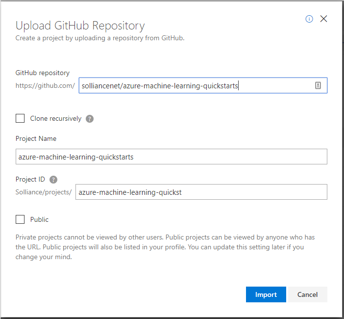
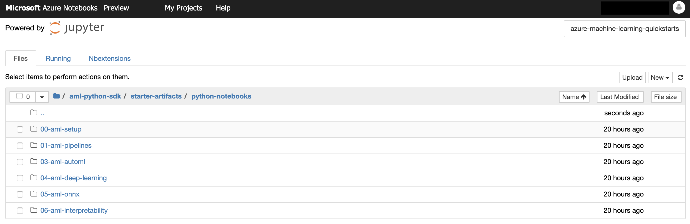

# Azure Notebooks Setup

At a high level, here are the setup tasks you will need to perform to prepare your Azure Notebooks Environment (the detailed instructions follow):

1. Setup an Azure Notebooks account. 

2. Setup Azure Notebooks Project

3. Start the Notebook Server

4. Locate the Quickstart Notebook

## Task 1: Setup an Azure Notebooks account
1. In your browser, navigate to https://notebooks.azure.com/.

2. Select Sign In from the top, right corner and sign in using your Microsoft Account credentials. After a successful login, you will have implicitly created the account and are ready to continue.

## Task 2: Setup Azure Notebooks Project

1. Log in to [Azure Notebooks](https://notebooks.azure.com/).

2. Navigate to **My Projects** page

3. Select **Upload GitHub Repo**.

4. In the Upload GitHub Repository dialog, for the GitHub repository provide `solliancenet/azure-machine-learning-quickstarts`, and select **Import**. Allow the import a few moments to complete, the dialog will dismiss once the import has completed.

## Task 3: Start the Notebook Server

1. Navigate to your project: `azure-machine-learning-quickstarts`

2. Start your Notebook server on `Free Compute` by selecting the **Play** icon in the toolbar as shown:

	

3. It should open **Jupyter Notebooks** interface.

## Task 4: Locate the Quickstart Notebooks 

1.  Navigate to the `>aml-python-sdk->starter-artifacts->python-notebooks` folder where you will find all your quickstart files.

	
