# Train a time-series forecasting model using Automated Machine Learning

## Lab Overview

In this lab you will learn how the Automated Machine Learning capability in Azure Machine Learning (AML) can be used for the life cycle management of the manufactured vehicles and how AML helps in creation of better vehicle maintenance plans. To accomplish this, you will train a Linear Regression model to predict the number of days until battery failure using Automated Machine Learning available in AML studio.

# Exercise 1: Creating a model using automated machine learning

## Task 1: Create an automated machine learning experiment using the Portal

1. Navigate to your Azure Machine Learning workspace in the Azure Portal. Select **Launch now** under the **Try the new Azure Machine Learning studio** message. Alternatively, you can navigate directly to the new [Azure Machine Learning studio](https://ml.azure.com/). This will prompt you to select the workspace as part of the sign-in process.

   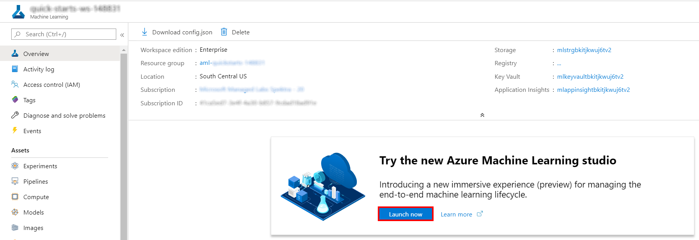

2. Select **Automated ML** in the left navigation bar.

   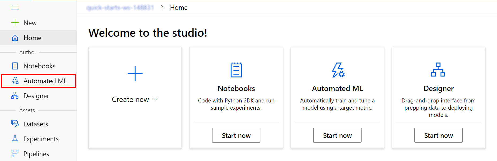

3. Select **New automated ML run** to start creating a new experiment.

   

4. Select **Create dataset** and choose the **From web files** option from the drop-down.

   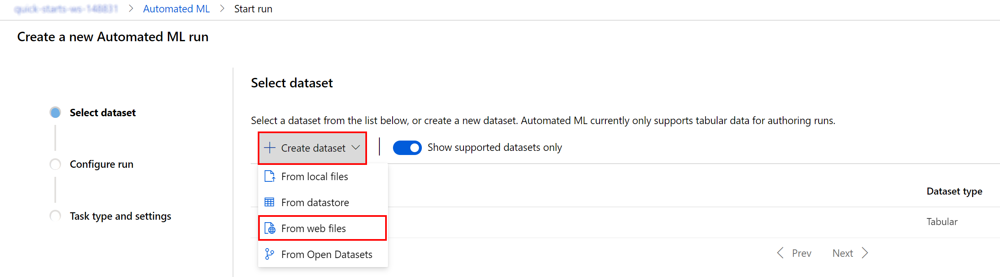

5. Fill in the training data URL in the `Web URL` field: `https://introtomlsampledata.blob.core.windows.net/data/battery-lifetime/training-formatted.csv`, make sure the name is set to `training-formatted-dataset`, and select **Next** to load a preview of the parsed training data.

   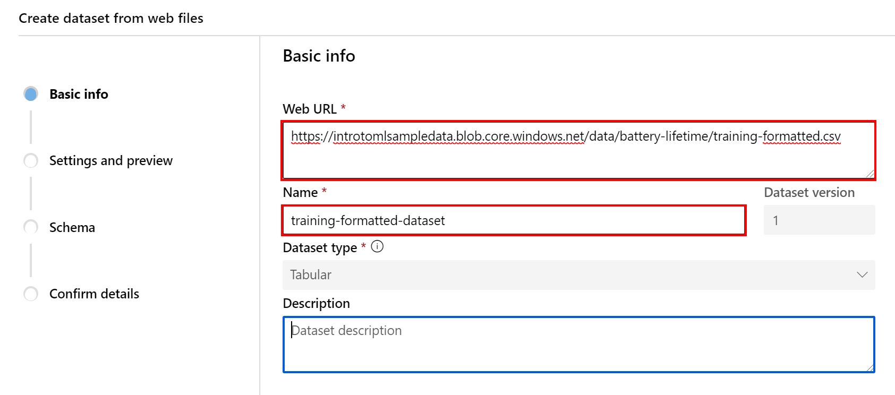

6. In the `Settings and preview` page, for the `Column headers` field, select `All files have same headers`. Scroll to the right to observe all of the columns in the data.

   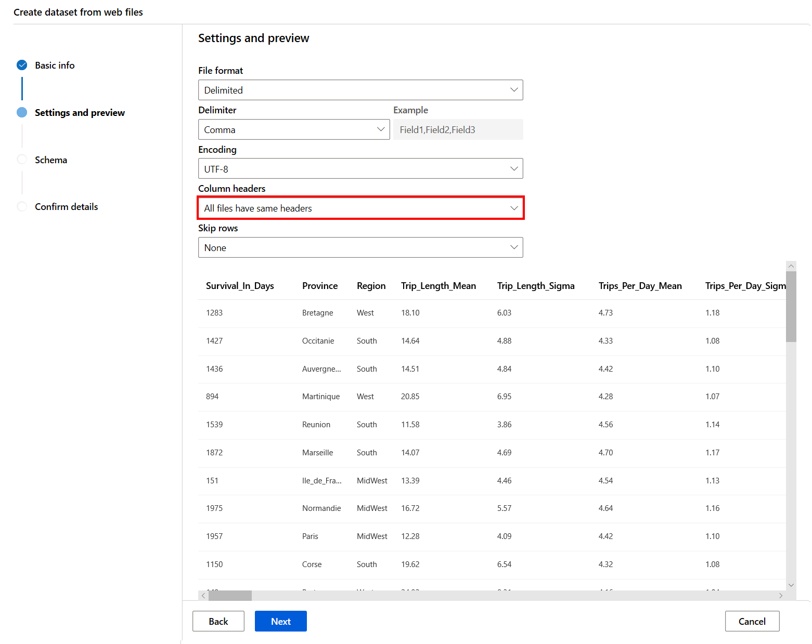

7. Select **Next** to check the schema and then confirm the dataset details by selecting **Next** and then **Create** on the confirmation page.

   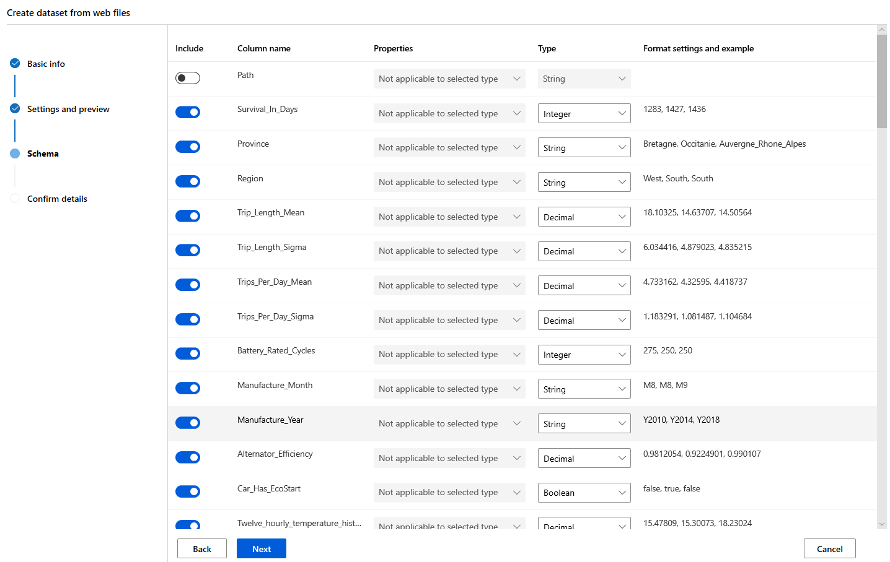

8. Now you should be able to select the newly created dataset for your experiment. Select the `training-formatted-dataset` dataset and select **Next** to move to the experiment run details page.

   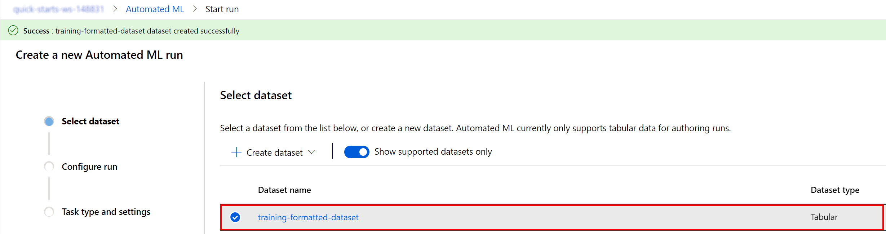

9. You will now configure the Auto ML run basic settings by providing the following values for the experiment name, target column and training compute:

   - Experiment name: **automlregression**
   - Target column: select **Survival_In_Days**
   - Select training compute target: : select **qs-compute**

   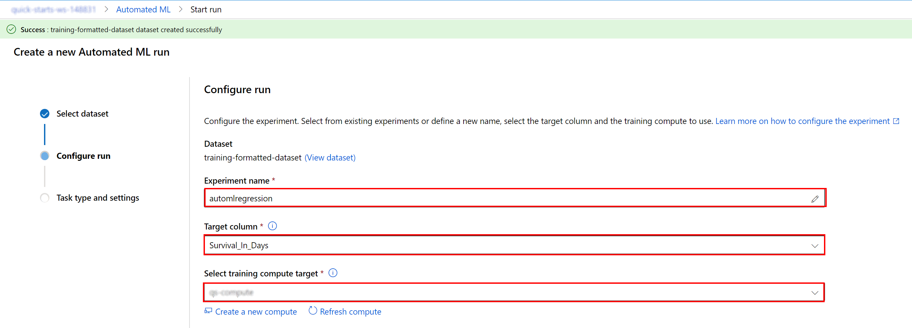

10. Select **Next** and select **Regression** in the `Task type and settings` page.

    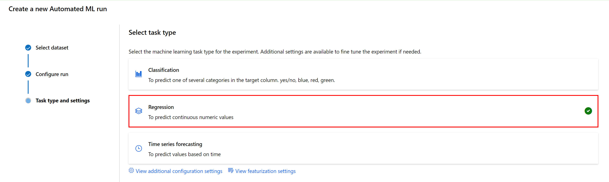

11. Select **View additional configuration settings** to open the advanced settings section. Provide the following settings:

    - Primary metric: **Normalized root mean squared error**
    - Exit criterion > Metric score threshold: **0.09**
    - Validation > Validation type: **k-fold cross validation**
    - Validation > Number of Cross Validations: **5**
    - Concurrency > Max concurrent iterations: **1**

    

12. Select **Save** and then **Finish** to begin the automated machine learning process.

    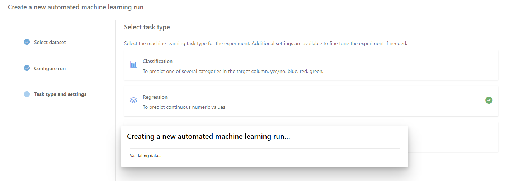

13. Wait until the `Run status` becomes **Running** in the `Run Detail page`.

    

## Task 2: Review the experiment run results

1. The experiment will run for about _15 minutes_. While it runs and once it completes, you should check the `Models` tab on the `Run Detail` page to observe the model performance for the primary metric for different runs.

   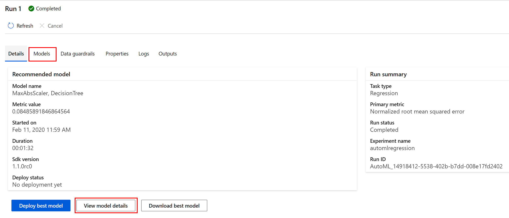

2. In the models list, notice at the top the iteration with the best **normalized root mean square error** score. Note that the normalized root mean square error measures the error between the predicted value and actual value. In this case, the model with the lowest normalized root mean square error is the best model.

   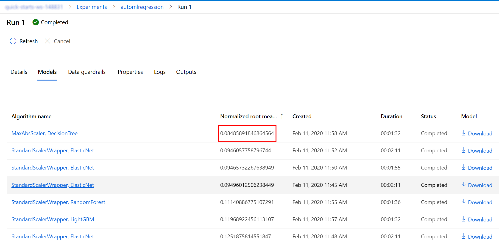

3. Select **Experiments** on the left navigation pane and select the experiment `automlregression` to see the list of available runs.

   

4. Select the option to **Include child runs** to be able to examine  model performance for the primary metric of different runs. By default, the left chart describes the `normalized_median_absolute_error` value for each run. Select the pen icon on the right corner of the `normalized_median_absolute_error` chart to configure the `normalized_root_mean_square_error` metric representation.

   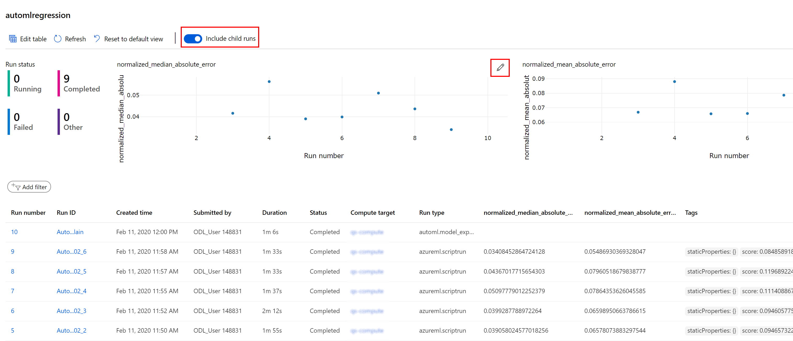

# Next Steps

Congratulations! You have trained a simple time-series forecasting model using automated machine learning in the visual interface. You can continue to experiment in the environment but are free to close the lab environment tab and return to the Udacity portal to continue with the lesson.