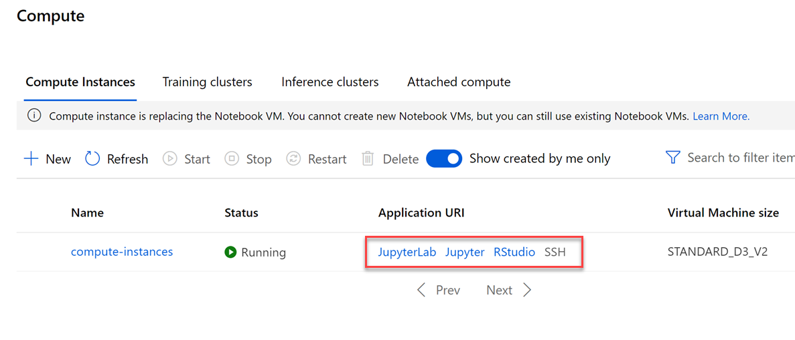

# Managing a compute instance

Machine learning requires several tools to prepare data, and train and deploy models. Most of the work usually takes place within web-based, interactive notebooks, such as Jupyter notebooks. Although notebooks are lightweight and easily run in a web browser, you still need a server to to host them.

So, the setup process for most users is to install several applications and libraries on a machine, configure the environment settings, then loaed any additional resources to begin working within notebooks or integrated development environments (IDEs). All this setup takes time, and there is sometimes a fair amount of troubleshooting involved to make sure you have the right combination of software versions that are compatible with one another.

What if you could use a ready-made environment that is pre-optimized for your machine learning development?

Azure Machine Learning [compute instance](https://docs.microsoft.com/azure/machine-learning/concept-compute-instance) provides this type of environment for you, and is fully managed, meaning you don't have to worry about setup and applying patches and updates to the underlying virtual machine. Plus, since it is cloud-based, you can run it from anywhere and from any machine. All you need to do is specify the type of virtual machine, including GPUs and I/O-optimized options, then you have what you need to start working.

The managed services, such as computer instance and compute cluster, can be used as a training compute target to scale out training resources to handle larger data sets. When you are ready to run your experiments and build your models, you need to specify a compute target. Compute targets are compute resources where you run your experiments or host your service deployment. The target may be your local machine or a cloud-based resource. This is another example of where managed services like compute instance and computer cluster really shine.

A managed compute resource is created and managed by Azure Machine Learning. This compute is optimized for machine learning workloads.

> Azure Machine Learning compute clusters and compute instances are the only managed computes. Additional managed compute resources may be added in the future.

# Overview

In this lab, you will explore different actions you can take to manage a compute instance in Azure Machine Learning Studio.

## Exercise 1: Create New Compute Instance

1. Within [Azure Machine Learning Studio](https://ml.azure.com/), navigate to **Compute**, then select **+New**.

    

2. In the `New Compute Instance` pane, provide the following information and then select **Create**.

    - Compute name: `provide an unique name`
    - Virtual Machine size: `Standard_D3_v2`

    

3. It will take couple of minutes for your compute instance to be ready.  Wait for your compute instance to be in status `Running`.

## Exercise 2: Explore Compute Instances

1. Select the radio button next to the name of your compute instance. This will select the instance, as indicated by a checkmark. Selecting your instance in this way enables the toolbar options above that enable you to Stop, Restart, or Delete the instance.

    

    There are different scenarios in which you will want to perform these actions. Here are the actions you can take on a selected compute instance, and what they do:

    * **Stop**: Since the compute instance runs on a virtual machine (VM), you pay for the instance as long as it is running. Naturally, it needs to run to perform compute tasks, but when you are done using it, be sure to stop it with this option to prevent unnecessary costs.
    * **Restart**: Restarting an instance is sometimes necessary after installing certain libraries or extensions. There may be times, however, when the compute instance stops functioning as expected. When this happens, try restarting it before taking further action.
    * **Delete**: You can create and delete instances as you see fit. The good news is, all notebooks and R scripts are stored in the default storage account of your workspace in Azure file share, within the "User files" directory. This central storage allows all compute instances *in the same workspace* to access the same files so you don't lose them when you delete an instance you no longer need.

2. Select the name of your instance. This opens the **Compute details** blade, revealing useful information about your compute instance.

    

    The **Attributes** describe the resource details of the compute instance, including the name, type, Azure subscription, the resource group to which it belongs, the Azure Machine Learning workspace that manages it, and the Azure region to which it is deployed. If you need to execute scripts that require details about your compute instance, this is where you can find most of what you need.

    The **Resource properties** show the status and configuration of the compute instance, including links to its applications and public and private endpoints. In this screenshot, you will see that SSH access is disabled. You cannot enable SSH access after creating a compute instance. You can only enable this option at the time of creation. SSH access allows you to securely connect to the VM from a terminal or command window. Use the public IP address to connect via SSH or an integrated development environment (IDE) like [Visual Studio Code](https://docs.microsoft.com/azure/machine-learning/tutorial-setup-vscode-extension).

3. Navigate back to **Compute**. The compute instance comes preconfigured with tools and environments that enable you to author, train, and deploy models in a fully integrated notebook experience. You access these environments through the **Application URI** links located in the resource properties (as seen in the previous step), and next to each compute instance in the list.

    

4. Select each of the application links to sign in to the related environment. You may be prompted to select your user account for each application.

# Next Steps

Congratulations! You have completed the introduction to managing a compute instance lab. You can continue to experiment in the environment but are free to close the lab environment tab and return to the Udacity portal to continue with the lesson.
