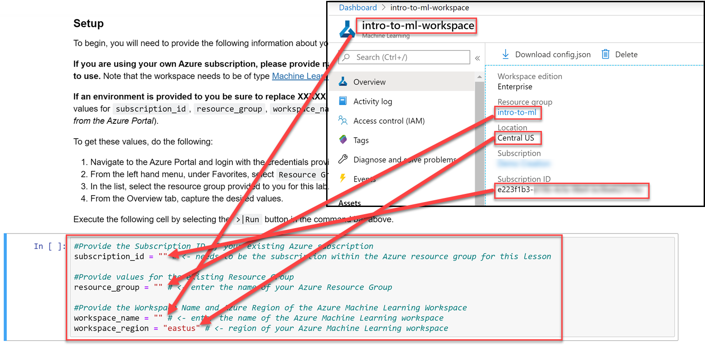

# Compute Resources

## Training and deploying a model from a notebook running in a Compute Instance

So far, the Managed Services for Azure Machine Learning lesson has covered **compute instance** and the benefits it provides through its fully managed environment containing everythng you need to run Azure Machine Learning.

The compute instance provides a comprehensive set of a capabilities that you can use directly within a python notebook or python code including:

- Creating a **Workspace** that acts as the root object to organize all artifacts and resources used by Azure Machine Learning.
- Creating **Experiments** in your Workspace that capture versions of the trained model along with any desired model performance telemetry. Each time you train a model and evaluate its results, you can capture that run (model and telemetry) within an Experiment.
- Creating **Compute** resources that can be used to scale out model training, so that while your notebook may be running in a lightweight container in Azure Notebooks, your model training can actually occur on a powerful cluster that can provide large amounts of memory, CPU or GPU. 
- Using **Automated Machine Learning (AutoML)** to automatically train multiple versions of a model using a mix of different ways to prepare the data and different algorithms and hyperparameters (algorithm settings) in search of the model that performs best according to a performance metric that you specify. 
- Packaging a Docker **Image** that contains everything your trained model needs for scoring (prediction) in order to run as a web service.
- Deploying your Image to either Azure Kubernetes or Azure Container Instances, effectively hosting the **Web Service**.

# Overview

In this lab, you start with a model that was trained using Automated Machine Learning. Learn how to use the Azure ML Python SDK to register, package, and deploy the trained model to Azure Container Instances (ACI) as a scoring web service. Finally, test the deployed model (1) by make direct calls on service object, (2) by calling the service end point (Scoring URI) over http.

## Exercise 1: Open Notebook for this Lab

1. Within Azure Machine Learning Studio, navigate to **Compute**, then select **Compute Instances**. For the Compute Instance that is available, under Application URI select `Jupyter`. Be sure to select `Jupyter` and not `JupterLab`.

   

2. Within the Jupyter environment, open the **Users** folder, then the folder that has your assigned username and then open `deployment-with-AML.ipynb`. This is the Python notebook you will step through executing in this lab.

   

3. In the Setup portion of the notebook, you will be asked to provide values for `subscription_id`, `resource_group`, `workspace_name`, and `workspace_region`. To find these, open your Azure Machine Learning workspace in the Azure portal and copy the values as shown:

   

4. Follow the instructions within the notebook to complete the lab.

# Next Steps

Congratulations! You have just learned how to use the Jupyter application on a compute instance to deploy a trained model to Azure Container Instances (ACI) for real-time inferencing. You can now return to the Udacity portal to continue with the lesson.

