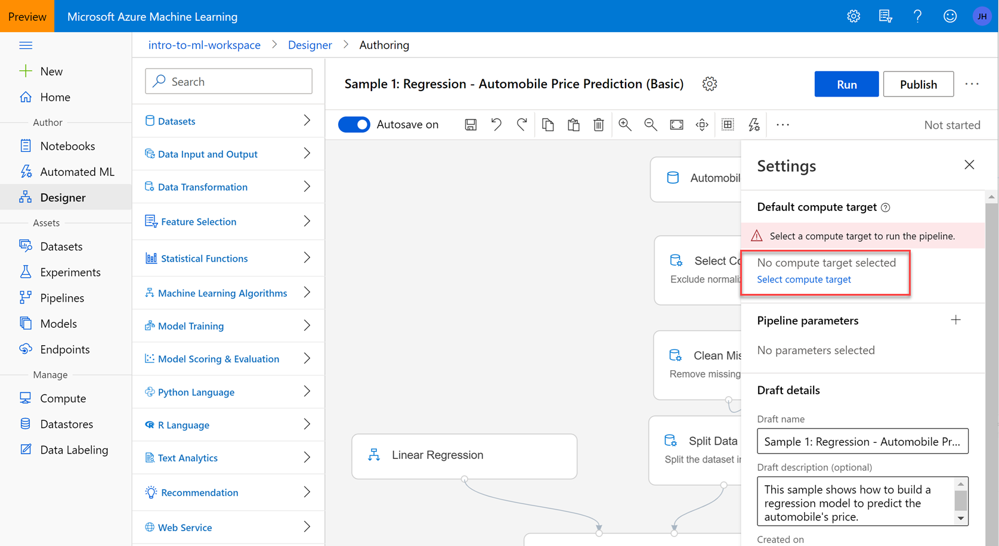
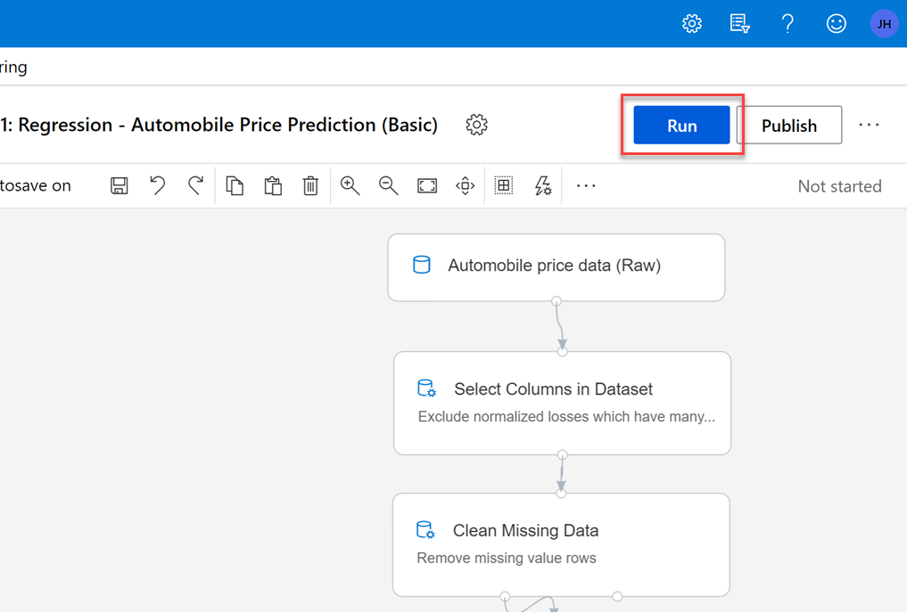
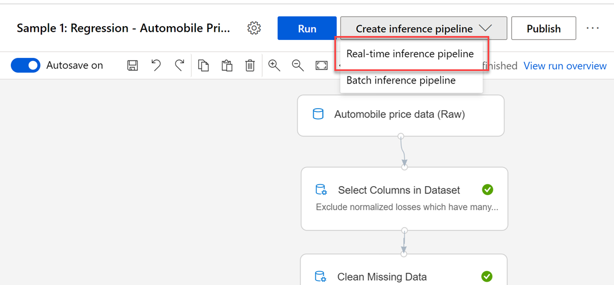
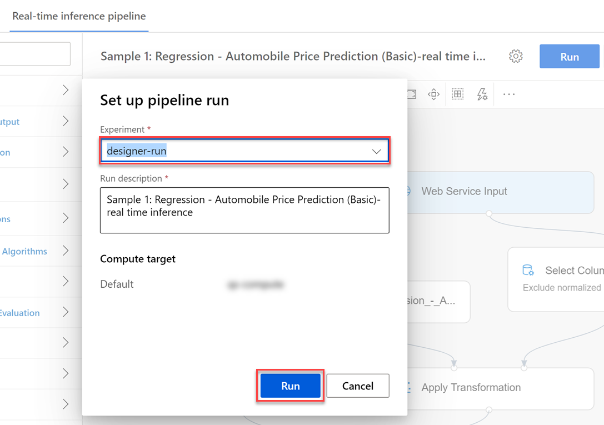
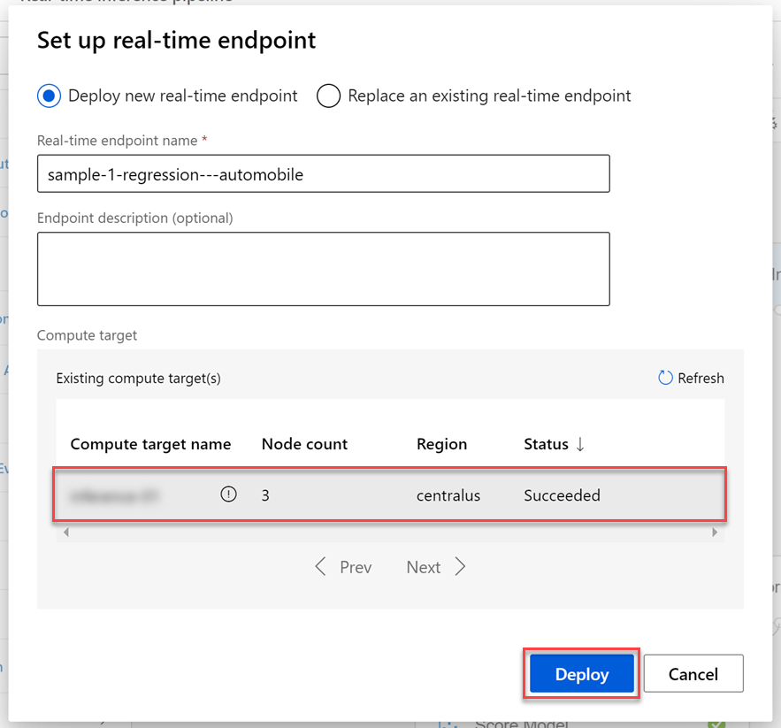
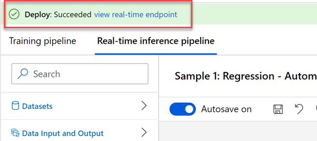
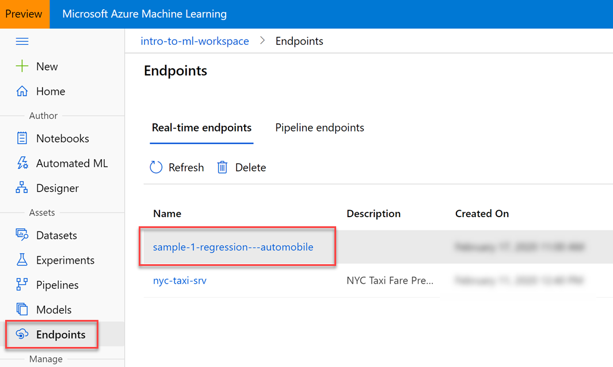
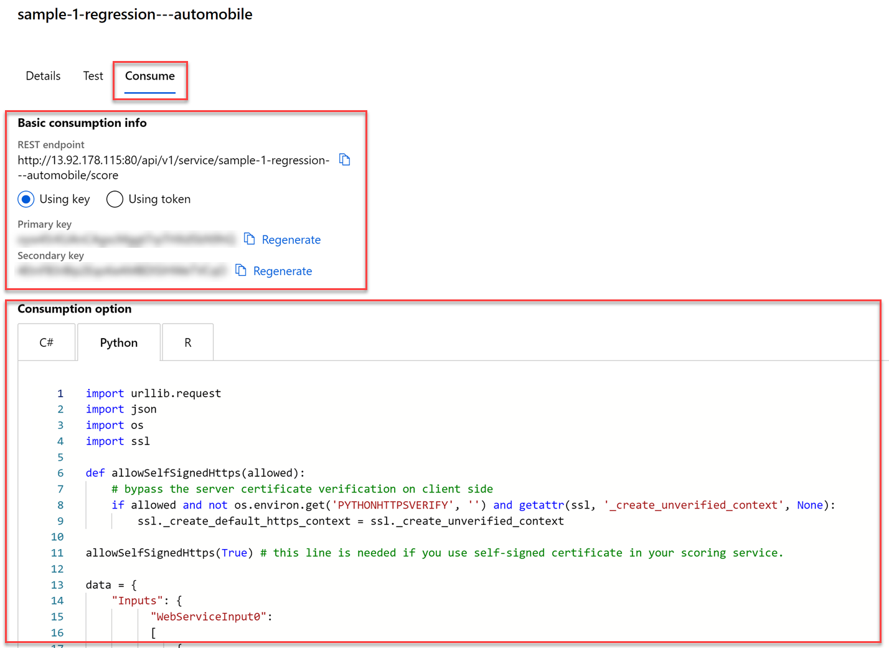

# Compute Resources

## Deploy a trained model as a webservice

In previous lessons, we spent much time talking about training a machine learning model, which is a multi-step process involving data preparation, feature engineering, training, evaluation, and model selection. The model training process can be very compute-intensive, with training times spanning across many hours, days, or weeks depending on the amount of data, type of algorithm used, and other factors. A trained model, on the other hand, is used to make decisions on new data quickly. In other words, it infers things about new data it is given based on its training. Making these decisions on new data on-demand is called real-time inferencing.

# Overview

In this lab, you learn how to deploy a trained model that can be used as a webservice, hosted on an Azure Kubernetes Service (AKS) cluster. This process is what enables you to use your model for real-time inferencing.

The Azure Machine Learning designer simplifies the process by enabling you to train and deploy your model without writing any code.

## Exercise 1: Open a sample training pipeline

### Task 1: Open the pipeline authoring editor

1. In [Azure portal](https://portal.azure.com/), open the available machine learning workspace.

2. Select **Launch now** under the **Try the new Azure Machine Learning studio** message.

    

3. When you first launch the studio, you may need to set the directory and subscription. If so, you will see this screen:

    

    > For the directory, select **Udacity** and for the subscription, select **Azure Sponsorship**. For the machine learning workspace, you may see multiple options listed. **Select any of these** (it doesn't matter which) and then click **Get started**.

4. From the studio, select **Designer** in the left-hand menu. Next, select **Sample 1: Regression - Automobile Price Prediction (Basic)** under the **New pipeline** section. This will open a `visual pipeline authoring editor`.

   

### Task 2: Setup the compute target

1. In the settings panel on the right, select **Select compute target**.

   

2. In the `Set up compute target` editor, select the existing compute target, then select **Save**.

>> Note: If you are facing difficulties in accessing pop-up windows or buttons in the user interface, please refer to the Help section in the lab environment.

   

### Task 3: Create a new experiment and submit the pipeline

1. Select **Submit** to open the `Set up pipline run` editor.

   

    > Please note that the button name in the UI is changed from **Run** to **Submit**.

2. In the `Setup pipeline run editor`, select **Experiment, Create new** and provide `New experiment name`: **designer-run**, and then select **Submit**.

   

3. Wait for the pipeline run to complete. It will take around **10 minutes** to complete the run.

## Exercise 2: Real-time inference pipeline

### Task 1: Create pipeline

1. Select **Create inference pipeline**, then select **Real-time inference pipeline** from the list to create a new inference pipeline.

   

### Task 2: Submit the pipeline

1. Select **Submit** to open the `Set up pipeline run` editor.

   

    > Please note that the button name in the UI is changed from **Run** to **Submit**.

2. In the `Setup pipeline run` editor, select **Select existing**, then select the experiment you created in an earlier step: **designer-run**. Select **Submit** to start the pipeline.

   

3. Wait for pipeline run to complete. It will take around **7 minutes** to complete the run.

## Exercise 3: Deploy web service on Azure Kubernetes Service compute

### Task 1: Deploy the web service

1. After the inference pipeline run is finished, select **Deploy** to open the `Set up real-time endpoint` editor.

   

2. In the `Set up real-time endpoint` editor, select your **existing compute target**, then select **Deploy**.

   

3. Wait for the deployment to complete. The status of the deployment can be observed above the `Pipeline Authoring Editor`.

   

### Task 2: Review deployed web service

1. To view the deployed web service, select the **Endpoints** section in your Azure Portal Workspace.

2. Select the deployed web service: **sample-1-regression---automobile** to open the deployment details page.

   

   *Note: you have to select the text of the service name to open the deployment details page*

### Task 3: Review how to consume the deployed web service

1. Select the **Consume** tab to observe the following information:

   1. `Basic consumption info` displays the **REST endpoint**, **Primary key**, and **Secondary key**.

   2. `Consumption option` shows code samples in **C#**, **Python**, and **R** on how to call the endpoint to consume the webservice.

   

# Next Steps

Congratulations! You have just learned how to train and deploy a model to an Azure Kubernetes Service (AKS) cluster for real-time inferencing. You can now return to the Udacity portal to continue with the lesson.

